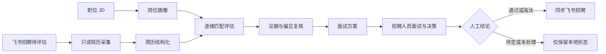

<p align="center">
  
</p>

<h1 align="center">识才</h1>

<p align="center">
  面向飞书招聘的本地化、可解释、人工可控的 AI 简历评估工作台
</p>

识才从飞书招聘的“简历评估 / 待评估”列表只读采集候选人，围绕职位 JD 生成岗位画像，自动完成简历结构化、逐维匹配、证据复核和面试设计。招聘人员始终负责最终决策，系统只会将明确的人工“通过”或“淘汰”同步回飞书。

> [!IMPORTANT]
> 本项目处理简历和面试记录等个人信息。使用者必须确保具有合法的招聘处理权限，并遵守适用的隐私、劳动和数据保护要求。自动评分只能作为辅助信息，不能代替人工录用决策。

## 目录

- [核心能力](#核心能力)
- [工作流程](#工作流程)
- [快速开始](#快速开始)
- [飞书接入](#飞书接入)
- [配置说明](#配置说明)
- [项目架构](#项目架构)
- [Agent 与 Skills](#agent-与-skills)
- [状态与同步规则](#状态与同步规则)
- [开发与测试](#开发与测试)
- [安全与隐私](#安全与隐私)
- [贡献与许可证](#贡献与许可证)

## 核心能力

- **JD 岗位画像**：将 JD 拆解为硬技能、相关经验、职责履行、基础门槛、技术方向五个维度，并保留权重、必备项、加分项和核验证据。
- **真实飞书采集**：使用可见 Chromium 和本地持久登录态，从飞书招聘待评估列表采集候选人，不依赖 Mock 数据。
- **循证简历评估**：逐项输出匹配状态、简历证据、能力缺口、风险和待核验项；证据缺失标记为未知，不推断为不满足。
- **双层质量控制**：评估 Agent 生成结果，复核 Agent 校验证据、评分计算和偏见风险，服务端统一重算加权分。
- **结构化面试设计**：围绕岗位画像和简历证据生成面试策略、必问题、触发式追问、案例题及 1-4 分行为锚点评分卡。
- **面试后评价**：面试完成后粘贴对话记录，按同一岗位维度生成优势、不足、未考察项、主张核验和录用建议。
- **人工决策隔离**：AI 的“建议通过 / 建议待定 / 建议淘汰”与招聘人员的“通过 / 待定 / 淘汰”严格分离。
- **安全状态同步**：只同步人工确认的通过和淘汰；飞书已有人工状态时，以飞书状态为准，不使用本地结果覆盖。
- **本地数据存储**：职位、简历、评估报告和任务记录默认保存在本地 SQLite，不提交到代码仓库。

## 工作流程



每位候选人的自动流水线为：

```text
parse -> evaluate -> review -> interview
```

面试评价是独立的后续阶段，只有招聘人员确认“面试已完成”后才开放输入和生成入口。

## 快速开始

### 环境要求

- Node.js 20 或更高版本
- npm 10 或更高版本
- 已安装并登录的 Codex CLI
- 可用的 `lark-cli`，用于读取飞书文档和调用飞书开放能力
- 有权访问目标职位的飞书招聘账号

### 安装

```bash
git clone <your-repository-url>
cd <repository-directory>
npm install
npx playwright install chromium
cp .env.example .env
```

`.env.example` 默认使用真实 `codex` Agent Provider。启动前请确认本机 `codex` 和 `lark-cli` 命令可用，或在 `.env` 中填写其绝对路径。

### 启动开发环境

```bash
npm run dev
```

启动后访问：

| 服务 | 地址 |
| --- | --- |
| Web 工作台 | <http://127.0.0.1:5283> |
| API 服务 | <http://127.0.0.1:8897> |
| 健康检查 | <http://127.0.0.1:8897/api/health> |

本地数据库和浏览器登录态位于 `.data/`，该目录已被 Git 忽略。

### 首次使用

1. 打开“职位与 JD”，创建职位。职位名称必须与飞书招聘中的名称完全一致。
2. 粘贴 JD 正文，或填写当前飞书账号有权读取的飞书文档链接。
3. 等待岗位画像生成完成。
4. 在职位卡片中点击“采集简历”。
5. 首次采集会打开 Chromium，请登录飞书并保持窗口可见。
6. 导入完成后，系统会自动执行结构化、评估、复核和面试设计。
7. 在候选人页面按匹配度查看结果，并由招聘人员设置最终状态。

## 飞书接入

### 简历采集

采集器监听飞书招聘页面自然发出的列表响应，并通过页面滚动或“下一页”加载后续数据。它只读取候选人列表、默认简历和简历正文，不会在采集阶段点击通过、淘汰、转移阶段或填写评价。

也可以从命令行启动：

```bash
npm run collect -- \
  --tenant-url https://your-company.feishu.cn \
  --job-name "飞书中的准确职位名" \
  --position-id "本系统职位 ID" \
  --api-base http://127.0.0.1:8897 \
  --import
```

首次验证建议限制候选人数并使用只采集模式：

```bash
npm run collect -- \
  --tenant-url https://your-company.feishu.cn \
  --job-name "飞书中的准确职位名" \
  --limit 5 \
  --dry-run
```

运行 `npm run collect -- --help` 可查看全部参数。断点续传和缓存说明见 [docs/RUNBOOK.md](docs/RUNBOOK.md)。

### 人工决策同步

飞书应用需要启用 Bot 身份，并申请、发布以下权限：

| 权限 | 用途 |
| --- | --- |
| `hire:application` | 读取投递、转移阶段、终止投递 |
| `hire:job.composite_info:readonly` | 读取职位详情与招聘流程 ID |
| `hire:job_process:readonly` | 读取招聘流程和官方阶段列表 |

应用的数据权限范围还必须覆盖目标职位。同步行为遵循幂等规则，相同目标已完成时会跳过；写入失败不会回滚本地人工判断。

## 配置说明

所有运行配置都从项目根目录的 `.env` 读取。

| 变量 | 默认值 | 说明 |
| --- | --- | --- |
| `HOST` | `127.0.0.1` | API 监听地址 |
| `PORT` | `8897` | API 端口 |
| `WEB_PORT` | `5283` | Web 开发端口 |
| `AGENT_PROVIDER` | `.env.example` 中为 `codex` | Agent Provider；`mock` 仅用于显式测试 |
| `AGENT_TIMEOUT_MINUTES` | `10` | 单个 Agent 阶段超时 |
| `AGENT_CONCURRENCY` | `1` | 同时运行的候选人任务数 |
| `EVALUATION_MAX_ATTEMPTS` | `3` | 单个评估阶段自动恢复的最大尝试次数 |
| `EVALUATION_RETRY_DELAY_MS` | `1500` | 首次自动重试等待时间，后续按指数退避 |
| `LARK_HIRE_SYNC_TIMEOUT_SECONDS` | `60` | 飞书决策同步超时 |
| `CODEX_BIN` | `codex` | Codex CLI 路径覆盖 |
| `LARK_CLI_BIN` | `lark-cli` | lark-cli 路径覆盖 |
| `DATA_DIR` | `<project>/.data` | SQLite 和任务数据目录 |
| `FEISHU_TENANT` | 空 | 飞书租户根地址 |
| `FEISHU_HIRE_URL` | 空 | 命令行采集器使用的飞书租户根地址 |
| `FEISHU_EVALUATION_URL` | 空 | 飞书招聘“简历评估 / 待评估”完整地址 |

> [!NOTE]
> 服务端源码在未加载 `.env` 时保留 `mock` 默认值，便于隔离测试。按上述步骤复制 `.env.example` 后，正常运行使用真实 `codex` Provider，运行时不会静默降级到 Mock。

## 项目架构

```text
.
├── agents/       # 各 AI 阶段的输入输出约束
├── collector/    # 基于 Playwright 的飞书招聘只读采集器
├── docs/         # 运行手册与隐私说明
├── server/       # Express API、SQLite、任务队列和飞书同步
├── skills/       # 面向 Codex 的可复用招聘工作流 Skills
└── web/          # React + Vite 招聘工作台
```

主要技术栈：

- React、TypeScript、Vite
- Express、Zod、better-sqlite3
- Playwright
- Recharts
- Codex CLI、lark-cli

服务端提供职位、候选人、任务、采集、评估、面试和同步 API。常用调试入口包括：

```text
GET  /api/health
GET  /api/jobs
GET  /api/candidates
GET  /api/tasks
POST /api/import/feishu
POST /api/candidates/:id/evaluate
POST /api/candidates/:id/interview
POST /api/candidates/:id/interview-evaluation
POST /api/candidates/:id/sync
POST /api/jobs/:id/sync-decisions
```

## Agent 与 Skills

### 运行时 Agent

| Agent | 职责 | 关键边界 |
| --- | --- | --- |
| JD 岗位画像 | 将 JD 拆解为五维画像 | 不添加 JD 未表达的门槛 |
| 简历结构化 | 提取明确履历事实 | 不评分，不输出无关个人信息 |
| 职位匹配评估 | 输出逐维分数、证据与风险 | 未知不等于不满足 |
| 评估质量复核 | 核验证据、计算、完整性和偏见 | 发现问题时修订，不虚构材料 |
| 面试设计 | 生成循证问题、案例和评分卡 | 围绕画像核验，不做人格判断 |
| 面试评价 | 基于对话记录生成逐维评价 | 未考察不等于不足 |

阶段约束位于 `agents/*/AGENTS.md`，每个 Agent 只接收完成其职责所需的输入。

### 项目 Skills

| Skill | 用途 |
| --- | --- |
| `shicai-screen-candidates` | 岗位画像、只读采集、简历评估与复核 |
| `shicai-interview-evidence` | 面试前结构化设计与面试后循证评价 |
| `shicai-feishu-decision-sync` | 通过浏览器核对并同步人工通过或淘汰状态 |

Skills 位于 `skills/`，用于复用用户工作流和副作用边界；运行时 Agent 的实现仍由服务端任务队列负责编排。

## 状态与同步规则

| 飞书状态 | 本地人工状态 | 系统行为 |
| --- | --- | --- |
| 待评估 | 通过 | 将通过同步到飞书下一官方阶段 |
| 待评估 | 淘汰 | 在飞书终止投递 |
| 待评估 | 待定或未处理 | 仅保留本地，不同步 |
| 非待评估 | 任意 | 采用飞书已有状态，本地只对齐，不覆盖 |

以下内容永远不会直接触发飞书写入：

- AI 推荐结论
- `pending`、`processing`、`reviewed`、`hold`、`failed` 状态
- 尚未由招聘人员确认的评估结果

手动重试接口：

```bash
# 单个候选人
curl -X POST http://127.0.0.1:8897/api/candidates/<candidate-id>/sync

# 一个职位下所有可同步人工决策
curl -X POST http://127.0.0.1:8897/api/jobs/<job-id>/sync-decisions
```

## 开发与测试

```bash
# 运行全部测试
npm test

# 构建 Web
npm run build

# Web 代码检查
npm run lint -w web

# 分工作区测试
npm run test -w server
npm run test -w web
npm run test -w collector
```

提交改动前至少运行：

```bash
npm test
npm run build
npm run lint -w web
```

项目约定单个代码文件不超过 300 行。新增能力应按职责拆分，并为状态规则、评分计算、API 和采集逻辑补充测试。

## 安全与隐私

- 浏览器登录态保存在 `.data/feishu-profile`，不得提交或分享。
- 候选人缓存位于 `collector/output`，属于敏感招聘数据。
- 日志不应记录 Cookie、鉴权头、完整简历、联系方式或完整模型输入。
- 发送给分析 Agent 前，应隐藏姓名、电话、邮箱、证件号等与评估无关的信息。
- 不得使用或推断年龄、性别、民族、国籍、宗教、健康、婚育、残障、照片等受保护属性。
- 职位标准应先于候选人评价确定，所有结论都应能回溯到 JD 和候选人证据。
- 数据保留期限、访问权限和删除流程应由使用组织明确规定。

完整要求见 [docs/PRIVACY.md](docs/PRIVACY.md)。生产运行和故障恢复见 [docs/RUNBOOK.md](docs/RUNBOOK.md)。

## 贡献与许可证

欢迎通过 Issue 描述缺陷、复现步骤或改进建议，也欢迎提交小而聚焦的 Pull Request。贡献代码前请确保：

1. 不提交真实简历、面试记录、飞书登录态或组织域名。
2. 不降低人工决策边界、证据要求和受保护属性限制。
3. 新功能包含必要测试，并通过项目现有检查。
4. 单个代码文件保持在 300 行以内。

当前仓库尚未包含 `LICENSE` 文件，因此暂未授予复制、修改或再分发代码的开源许可。若计划公开发布，请由项目所有者先选择并添加合适的许可证，再接受外部贡献。
