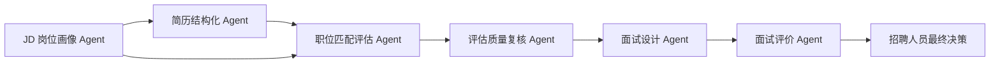
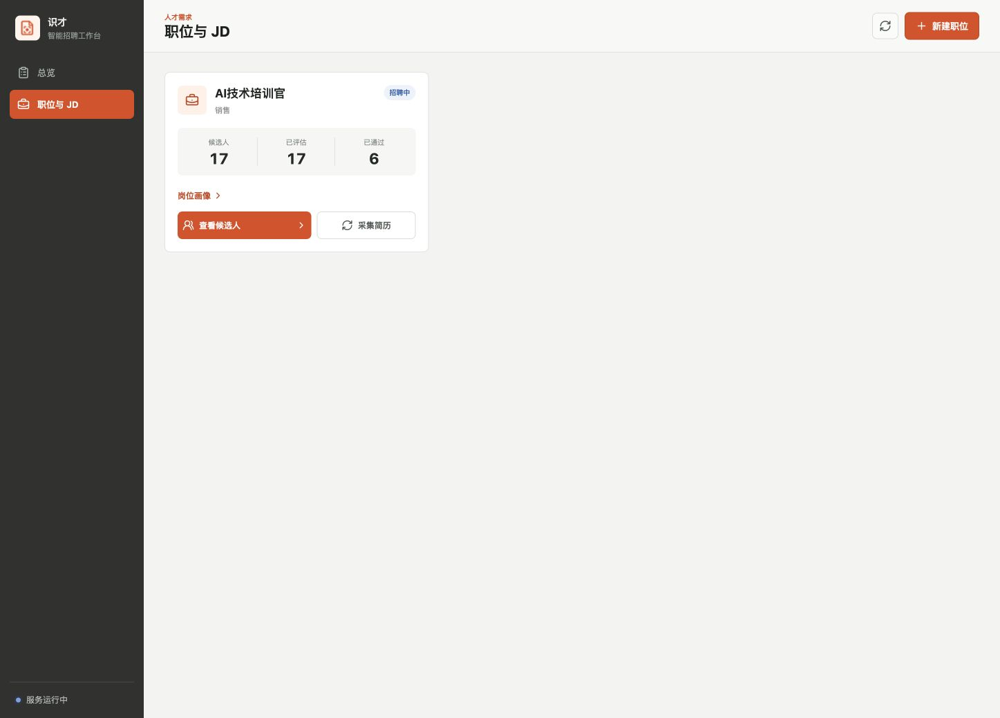
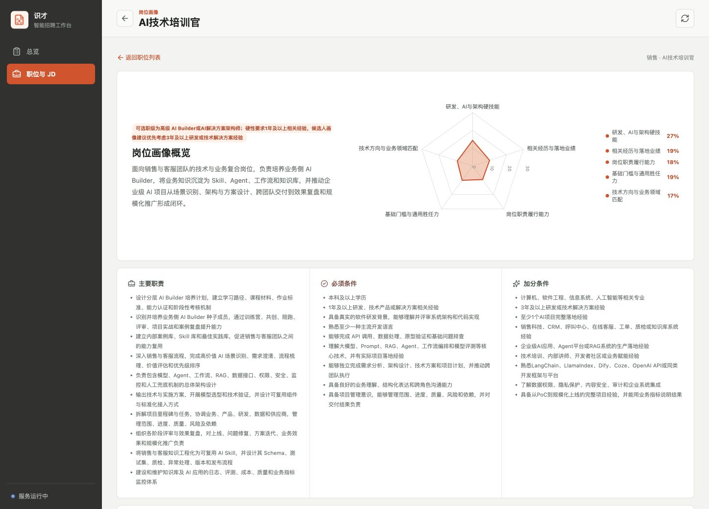
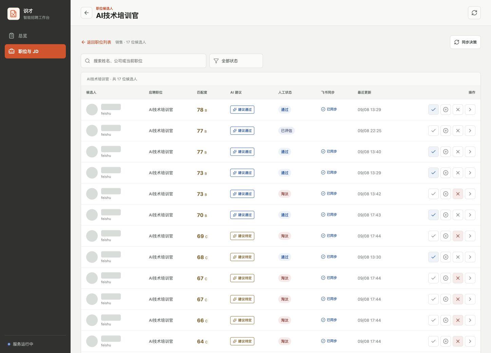
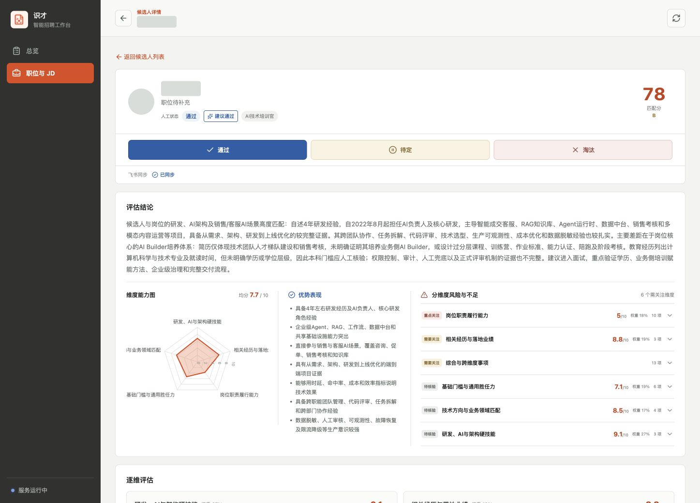
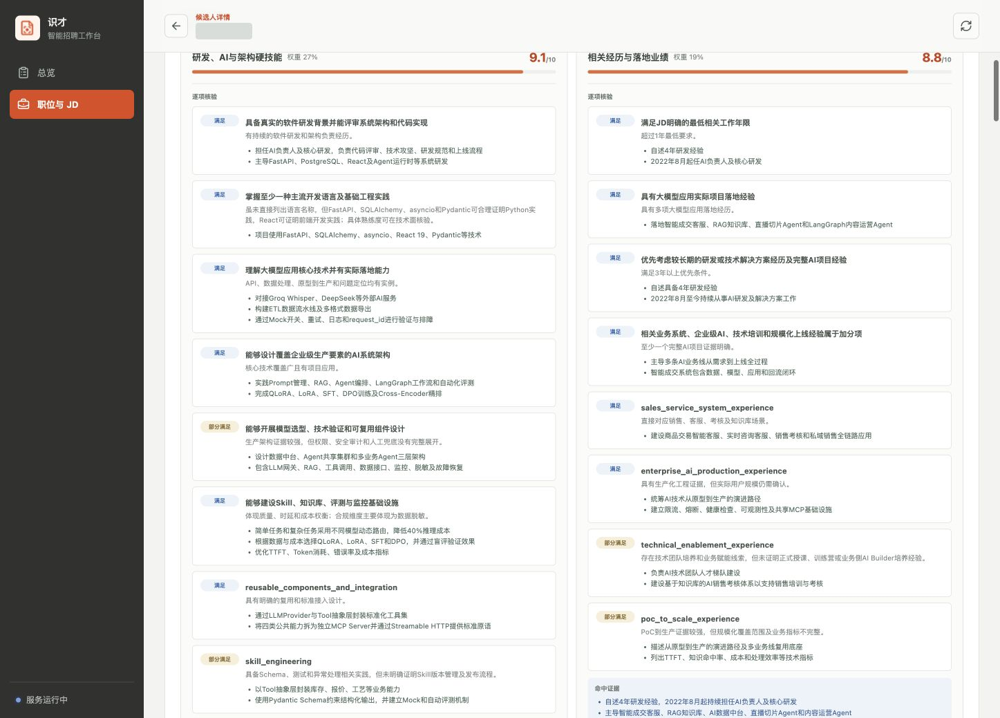
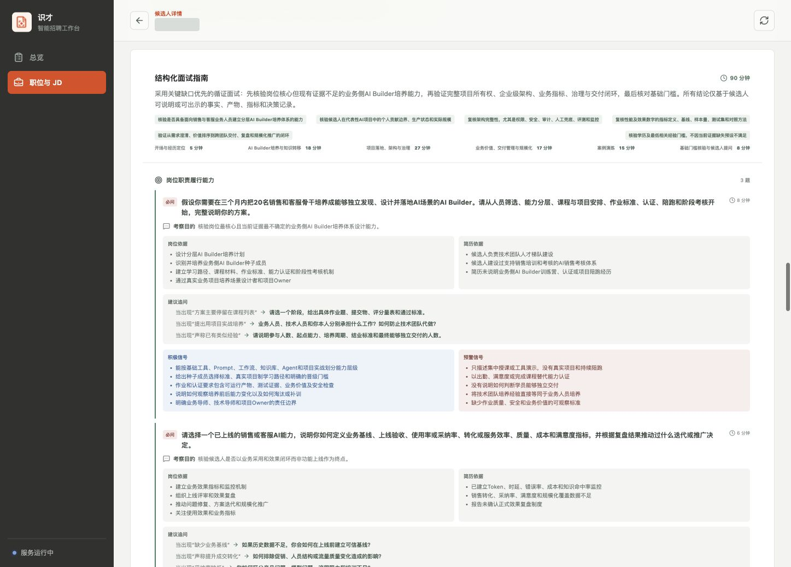

# 把岗位画像、简历证据与面试决策放进同一条招聘工作流

这是一套面向使用有招聘需求的 AI 原生招聘工作台。系统不是用一个通用模型直接给简历打分，而是由多个职责明确的招聘 Agent 协作完成 JD 分析、简历结构化、岗位匹配、质量复核、面试设计与面试评价，帮助团队更快形成一致、可解释、可复核的用人判断。

围绕四个核心价值构建：

- **画像先行**：从 JD 拆解硬技能、经验、岗位履责、基础门槛与业务领域匹配，建立统一的评价标尺。
- **证据驱动**：评分、优势、风险与逐项核验均落到简历中的真实证据，不只输出一个无法解释的总分。
- **多 Agent 协作**：不同智能体各司其职，上一个阶段的结构化产物成为下一个阶段的输入，并由独立复核 Agent 检查评估质量。
- **闭环协作**：覆盖候选人排序、人工复核、结构化面试、面试评价和飞书招聘状态同步。

## 产品价值

### 让招聘判断从“读过简历”升级为“有依据地决策”

这个产品以职位为入口，把岗位要求、候选人证据、筛选状态和面试问题串成一条连续流程：

1. **导入 JD**：从飞书文档读取并解析岗位要求。
2. **生成画像**：形成招聘维度、权重、门槛与加分条件。
3. **评估排序**：根据候选人简历证据计算匹配度并给出建议。
4. **人工复核**：招聘人员确认通过、待定或淘汰。
5. **面试闭环**：生成结构化面试问题，并在面试完成后形成评价。

这套流程带来三项核心变化：

- **统一标准**：同一职位下的候选人使用同一套岗位画像和权重，减少面试官各自理解造成的偏差。
- **细到维度**：总分之外，展示逐维能力、满足度、证据、缺口与风险，便于快速定位争议点。
- **保留人工决策**：系统提供建议，最终状态由招聘人员确认；只有通过和淘汰同步回飞书招聘。

适用于以下场景：

- 候选人数量较大、岗位专业度较高，需要快速建立初筛优先级。
- 业务与 HR 对岗位理解不一致，需要用统一画像对齐评价标准。
- 面试结果难以复盘，希望问题、证据与结论形成完整记录。

## 多 Agent 招聘协作引擎

### 不是一次提示词，而是一支分工清晰的 AI 招聘团队

识才将招聘判断拆成六个相互衔接的 Agent。每个 Agent 只处理自己负责的阶段，使用明确的输入、输出格式和判断边界，减少“一次生成全部结论”带来的遗漏、漂移与不可解释问题。

| AI Agent | 在招聘流程中的职责 | 交付结果 |
| --- | --- | --- |
| JD 岗位画像 Agent | 理解岗位目标，拆解能力维度、权重、硬门槛和加分项 | 可执行的岗位画像与统一评价标尺 |
| 简历结构化 Agent | 从非结构化简历中提取任职经历、项目、技能、成果和时间线 | 可核验的候选人事实档案 |
| 职位匹配评估 Agent | 将候选人证据逐条映射到岗位画像，识别满足度、优势、缺口与风险 | 多维匹配报告、匹配分和 AI 建议 |
| 评估质量复核 Agent | 独立检查证据引用、维度完整性、评分计算与潜在偏差 | 经复核的评估结论与修订意见 |
| 面试设计 Agent | 把关键缺口和待核验主张转化为结构化问题、追问和评分锚点 | 针对单个候选人的面试作战手册 |
| 面试评价 Agent | 基于面试对话核验简历主张，并沿用岗位画像进行逐维评价 | 面试优势、不足、未考察项和录用建议 |

这种协作方式让 AI 的每一步都有清晰来源：岗位标准来自 JD，候选人判断来自简历证据，面试问题来自尚未确认的关键能力，最终结论则回到招聘人员手中。

### Skills 让 Agent 能力进入真实业务流程

除运行时 Agent 外，识才还把高频招聘动作沉淀为可复用的 Skills：候选人筛选 Skill 负责编排岗位画像、只读采集与简历评估；面试循证 Skill 连接面试前设计和面试后评价；飞书决策同步 Skill 则在核对线上状态后，只同步人工确认的通过或淘汰结果。

Agent 负责理解、分析和生成，Skills 负责按照既定步骤调用能力并守住操作边界。两者结合，使识才不仅“会分析简历”，还能够在真实飞书招聘流程中持续工作。

### AI 自动运行，异常可恢复，关键决策由人控制

候选人进入系统后，多个 Agent 会按照任务队列自动推进。每个阶段均保存处理状态和结构化结果；临时失败会自动重试，达到重试上限后明确标记失败，便于人工重新触发。整个过程中，AI 建议与人工状态始终分离，AI 不会自行替代招聘人员完成录用或淘汰决策。

## 职位工作台

### 以职位为中心组织招聘任务

每个职位集中呈现候选人规模、已评估数量、已通过数量与关键操作，支持多个职位并行管理。

*图 1：职位列表展示岗位进度，并提供岗位画像、候选人查看和飞书简历采集入口。*

- **进度一眼可见**：通过候选人总数、已评估和已通过三项指标，快速判断当前处理进度。
- **岗位画像独立呈现**：JD 岗位画像 Agent 为每个职位生成独立画像页面，业务、HR 与面试官共用同一套标准。
- **接入真实飞书流程**：从飞书招聘采集待评估简历，不使用模拟数据，处理结果继续回到既有招聘流程。

## 岗位画像

### 把 JD 拆成可评估、可解释的多维模型

JD 岗位画像 Agent 基于岗位职责和任职要求，生成画像概览、权重雷达图、主要职责、必须条件与加分条件。它不会添加 JD 未表达的门槛，而是把业务语言转化为后续 Agent 可以执行的评价标准。

*图 2：岗位画像以五类核心维度、权重雷达图和结构化岗位要求呈现。*

画像主要包含五类维度：

- 研发、AI 与架构硬技能
- 相关经历与落地业绩
- 岗位职责履行能力
- 基础门槛与通用胜任力
- 技术方向与业务领域匹配

维度权重直接参与候选人匹配度计算，确保最终排序与岗位优先级一致。必须条件与加分条件分开表达，既守住硬门槛，也保留优秀候选人的差异化优势。

## 候选人排序

### 先找到最值得投入时间的人

职位匹配评估 Agent 与评估质量复核 Agent 协同完成候选人分析。前者给出逐维判断，后者独立检查证据和评分；通过复核的结果再按匹配度排序，同时展示 AI 建议、人工状态、飞书同步状态和最近更新时间。

*图 3：候选人按照匹配度排序。截图中的姓名和头像标识已隐藏。*

- **建议标签**：AI 明确显示建议通过、建议待定或建议淘汰，帮助团队快速建立处理优先级，但不直接改变人工状态。
- **保护人工状态**：如果候选人在飞书中已经不是待评估状态，则以飞书中的人工状态为准；仍处于待评估的候选人使用本地复核状态。
- **选择性同步**：只有招聘人员确认通过或淘汰后才同步回飞书招聘，待定状态不会提前改变线上流程。

## 评估结论

### 总分之外，给出清晰的证据与风险

候选人详情采用全屏页面，集中展示人工状态、匹配度、综合评价、能力雷达图、优势表现以及按维度划分的风险与不足。

*图 4：候选人综合评估概览。截图中的姓名和头像标识已隐藏。*

- **优势与不足分开**：综合评价不再把正面与负面信息混在一起，便于快速阅读和会议讨论。
- **风险按维度归类**：每项风险关联具体维度、得分、权重和待核验项，避免笼统的“经验不足”。
- **结论可以追溯**：评估 Agent 的每个判断都能够回到简历证据或证据缺口，复核 Agent 再检查证据是否真正支持结论。

## 逐维核验

### 把匹配度拆到每一条岗位要求

每个维度以双列形式展示逐项满足度、简历证据和待核实信息，让岗位画像与候选人形成逐条映射。

*图 5：逐维评估展示满足、部分满足及相关证据明细。候选人姓名已隐藏。*

- **满足度分级**：使用满足、部分满足等状态，区分充分证据与仅有相关线索的能力项。
- **事实优先**：学历、年限、项目、技术栈和业务成果均以简历中的可见信息为依据，不把推测当成能力。
- **直接生成追问**：证据不足的关键要求会交给面试设计 Agent，自动转化为面试核验重点，减少面试官临场遗漏。

## 结构化面试

### 让面试问题始终围绕岗位画像

面试设计 Agent 按照招聘画像的能力维度设计问题，并同时提供考察目的、岗位依据、简历依据、建议追问、积极信号和预警信号。面试完成后，面试评价 Agent 再基于完整对话记录核验候选人表现。

*图 6：结构化面试指南包含问题、证据依据、追问路径和评价信号。候选人姓名已隐藏。*

- **问题有来源**：每道题同时关联岗位要求和候选人的简历主张，避免模板化提问。
- **追问有路径**：根据不同回答提供验证方向，帮助面试官追到事实、产物、指标和复盘结果。
- **评价有门槛**：只有确认面试完成后才开启评价；面试评价 Agent 结合完整对话、岗位画像和简历证据形成结论，未考察的能力不会被判定为不足。

## 落地与治理

### 接入现有飞书招聘，不改变团队的最终决策权

识才定位为招聘决策辅助工作台：自动化处理重复的信息整理和证据核验工作，关键状态仍由招聘人员确认。

| 能力层 | 产品处理 | 控制原则 |
| --- | --- | --- |
| 数据采集 | 读取飞书招聘待评估简历，以及飞书文档中的 JD | 使用真实登录状态，避免重复覆盖线上人工状态 |
| Agent 协作评估 | 生成岗位画像、候选人评估、质量复核和面试材料 | 分阶段运行并保存结构化产物，结果可追溯 |
| 本地数据 | 保存职位、候选人、评估报告和任务状态 | 使用本地 SQLite 留存流程数据，便于复核与恢复 |
| 人工复核 | 招聘人员确认通过、待定或淘汰 | AI 提供建议，不替代最终用人决定 |
| 状态同步 | 人工确认通过或淘汰后同步回飞书招聘 | 待定不同步，飞书中的非待评估状态优先 |

建议按照以下路径逐步落地：

1. 选择一个高频招聘职位，确认 JD 与岗位画像，建立首个评价基准。
2. 采集待评估简历，抽样复核评分、证据和风险维度，校准通过与淘汰阈值。
3. 邀请业务面试官使用结构化问题与评分卡，完成一次完整的面试闭环。
4. 确认状态同步规则后扩展到更多职位，并定期复盘岗位画像与实际录用表现。

> 识才让每一次筛选和面试，都有统一标准、清晰证据与可复核结论。

---

本文档中的截图均来自本地真实产品页面。候选人姓名与头像标识已经遮盖；页面中的其他内容仅用于产品功能演示。

*产品推广与方案介绍，更新日期：2026 年 9 月 9 日。*
